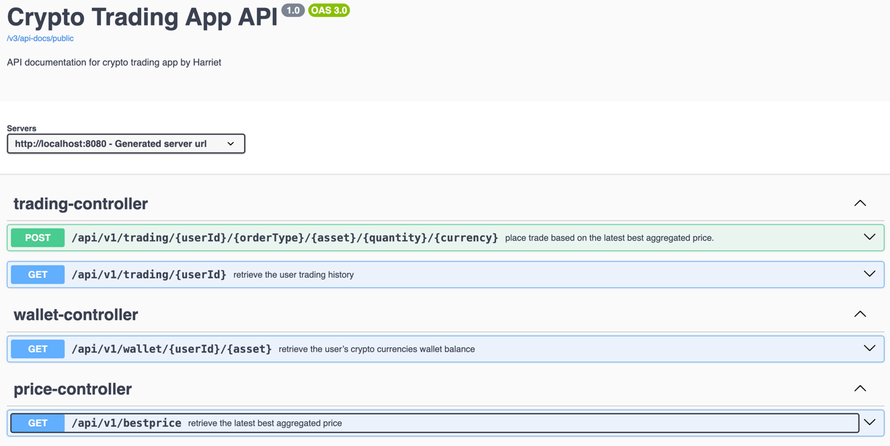
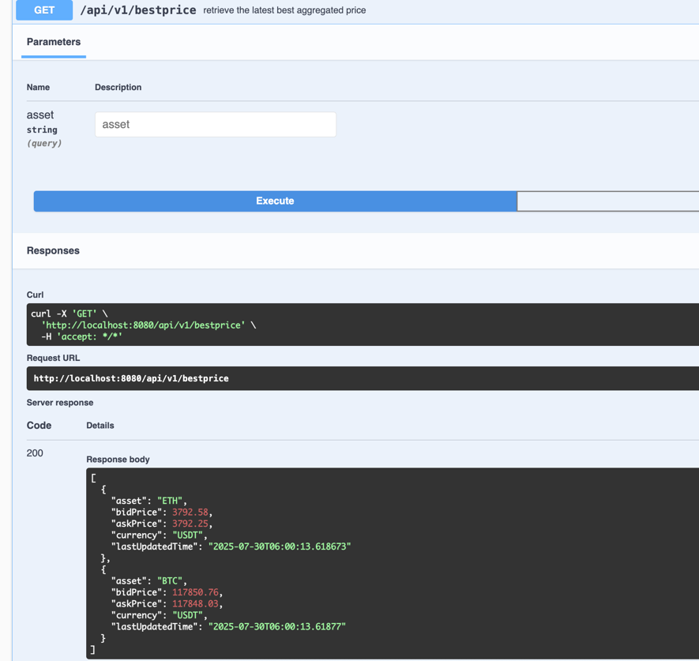
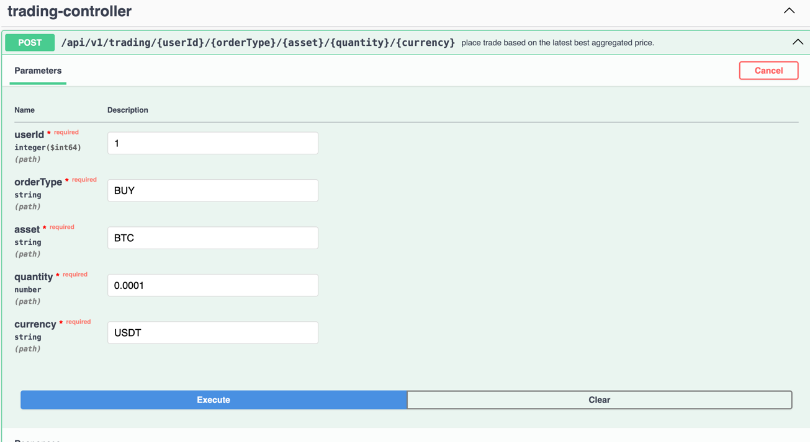
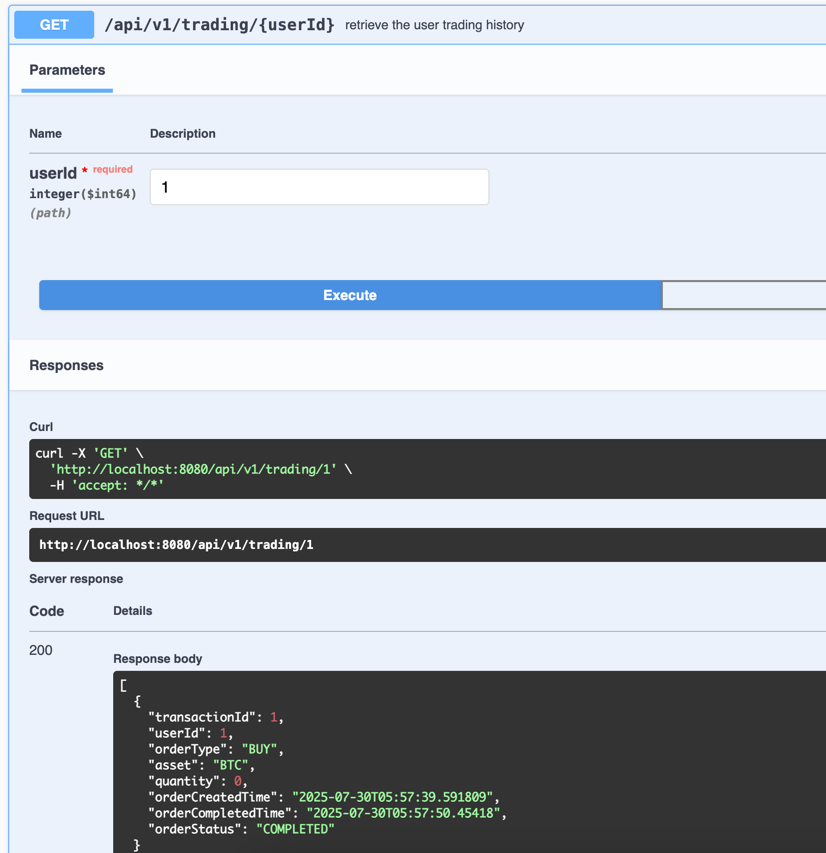
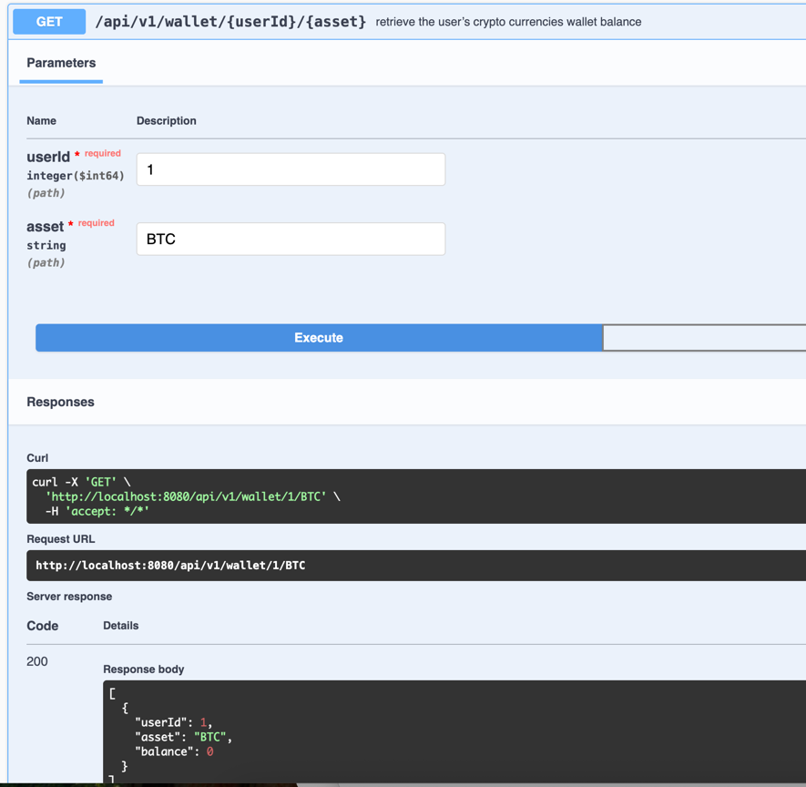

# CryptoTrading

### Below is the prerequisite installed software to run the project in local computer
1. Java 21
2. IntelliJ (optional for viewing the code)

### 💡 Description
Crypto trading application that place trades based on best aggregated price based on crypto asset and trade direction BUY/SELL

### 💡 Design Consideration
- Use database to persist and manage a FIFO queue, and a scheduled cron to process queued transaction
- Use a locked flag for each transaction in the database to make sure only one thread can execute trade at a time

### 🛠️ Setup Instructions

#### ✅ Step 1. Git Clone the Project to your local machine.
#### ✅ Step 2. Execute the following on your terminal
- cd <repo-folder-in-your-local>
- ./mvnw clean install
- ./mvnw spring-boot:run
#### ✅ Step 3. View the Api document via this swagger
http://localhost:8080/swagger-ui/index.html#/

